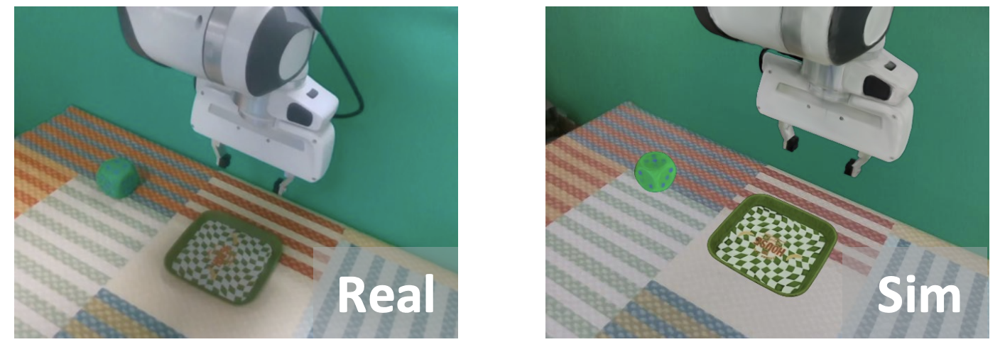

# Maniskill GS

A simulation platform combining **ManiSkill** robot simulation, **Gaussian Splatting** rendering, and **Real-to-Sim-to-Real** transfer learning for robotic manipulation tasks, built in [pi_RL: Online RL Fine-tuning for Flow-based Vision-Language-Action Models](https://arxiv.org/pdf/2510.25889).

For the full RL workflow (e.g. PPO with π₀.₅ on GSEnv), see [RL with Real2Sim2Real GSEnv](https://rlinf.readthedocs.io/en/latest/rst_source/examples/gsenv.html).

<p align="center">
  
</p>

## Setup

Use the Docker image or the install script from RLinf in [install-dependencies](https://rlinf.readthedocs.io/en/latest/rst_source/examples/pi0.html#install-dependencies).


Requires CUDA (for GS rendering). Clone the repo and install in editable mode (ManiSkill, Gymnasium, Nerfstudio, gsplat, etc. are listed in `pyproject.toml`):

```bash
git clone git@github.com:chenkang455/ManiSkill-GS.git
cd ManiSkill-GS
uv pip install -e . # Must use uv to ensure dependency overrides work
```

### Assets

Download [RLinf/gsenv-assets-v0](https://huggingface.co/datasets/RLinf/gsenv-assets-v0) (robot URDFs, GS PLY files, objects, etc.) into the project `assets/` folder:

```bash
export HF_ENDPOINT=https://hf-mirror.com
hf download RLinf/gsenv-assets-v0 --repo-type dataset --local-dir ./assets
```

## Tasks

- **PutCubeOnPlate-v0**: Pick a cube and place it on a designated plate

## Quick Start
```python
import mani_skill_gs
import gymnasium as gym

env = gym.make(
    "GSEnv-PutCubeOnPlate-v0",
    robot_uids="my_franka",
    render_mode="rgb_array",
    reward_mode="none",
    num_envs=16,
    control_mode="pd_ee_target_delta_pose",
    obs_mode="state",
    disable_env_checker=True,
    gs_kwargs={
        "render_interface": "gs_rlinf",
        "cache_table": True,
        "render_bs": 1,
        "device": "cuda",
    },
)
obs, info = env.reset()
print("Opening viewer...")
env.open_viewer()
while True:
    action = env.action_space.sample()
    env.step(action)
```

We provide the same maniskill return interface with the maniskill in RLinf:
```
python scripts/test_rlinf_interface.py
```

## Scripts

| Script | Description |
|--------|-------------|
| **`view_gs.py`** | Minimal quick start: create env with `gs_rlinf`, open Nerfstudio viewer, step with random actions (same as the Quick Start snippet). |
| **`test_rlinf_interface.py`** | Run env with `gs_rlinf` for a fixed number of steps, collect GS frames from `obs`, and save a single concatenated video (e.g. for multi-env) to `outputs/videos/`. |
| **`eval_openpi.py`** | Evaluate an OpenPI policy on GSEnv: run multiple episodes, log success rate, save per-episode GS videos under `outputs/eval/`. |
| **`collect_data.py`** | Collect successful trajectories using motion planning (e.g. `pick_cube`), export to LeRobot dataset format under `datasets/`. |
| **`eval_franka.py`** | Run OpenPI policy as a REST server: expose `/act` (image + instruction → action) for remote or real-robot inference. |
| **`align_sim_gs.py`** | Run env with both GS and sim render (`render_interface="env+gs"`), save three videos (GS only, sim only, alpha-blended) for sim–GS alignment comparison. |

## Acknowledgments

The core code and asset generation in this repo were primarily developed by [Bingwen Wei](https://openreview.net/profile?id=~Bingwen_Wei1) and [Jiakai Zhou](https://openreview.net/profile?id=~Jiakai_Zhou1). We thank the collaborators for their efforts in building this project. 